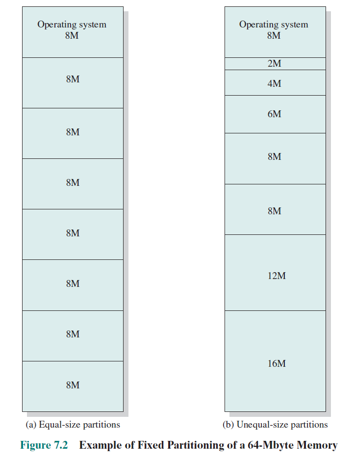
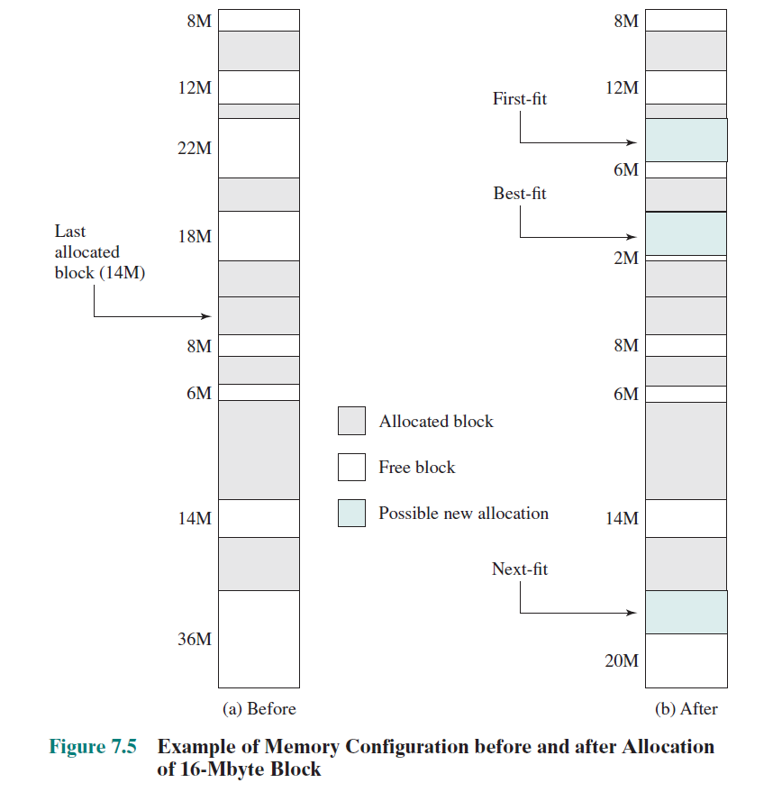
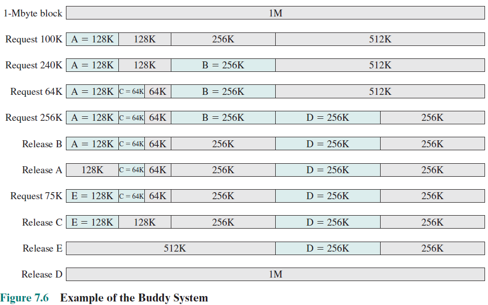
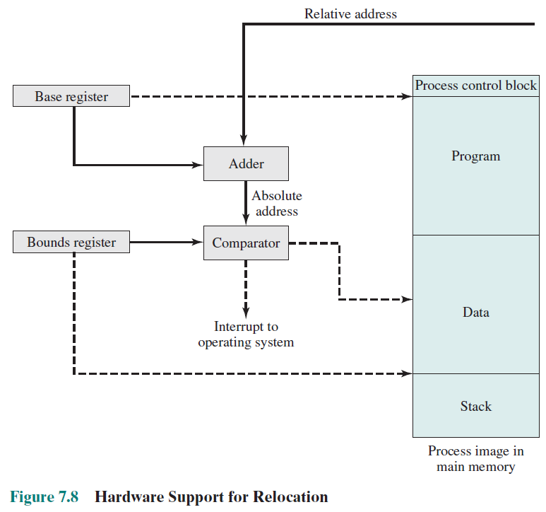

## What is memory management?
- Uni-programming systems only have a the kernel and one user program in the memory
- Multi-programming systems need to subdivide the user program memory so that multiple programs can reside in memory. The process by which an operating system performs and manages this sub-division is called **memory management**.

## What functions should memory management undertake?
- Relocation
- Protection
- Sharing
- Logical organization
- Physical organization
#### Relocation
Reasons why relocation may be required -
1. A user program cannot know beforehand what other programs will be resident in the main memory.
2. Processes will be swapped in and out of memory to maximize CPU utilization.
3. Quite limiting to specify that a swapped-out process should resume at the same region when swapped back in.
Therefore, we may need to **relocate** a process to a different region.
#### Protection
- A process should be secured from other processes being able to reference its memory locations (accidentally or intentionally).
- Relocation makes it this more complex - memory location to which the processes will be assigned is not pre-defined.
- Program code may access memory addresses dynamically (array index or a pointer that doesn't have a pre-defined value).
- Addresses reference by a process should be checked at runtime to ensure that it is only accessing a region that it is allowed to.
- The action of referencing an address is performed by the processor (by executing instructions), this means that it is processor's responsibility (not the OS) to ensure memory protection. So, the processor should have a hardware mechanism built-in to abort the instruction when it's executed.
#### Sharing
Why? Among other reasons because -
- There may be several processes running the same program. It is better for them to access the same program instead of creating a copy for each process
- Multiple processes cooperating on some task may access a shared data structure
Therefore, controlled shared access is required.
#### Logical Organization
- Main and secondary memory are organized as a sequence of memory addresses.
- But this is not how a program is organized. A program may be organized into modules and data.
- Logical organization is required because the program needs to have a view of the memory according to its needs and shouldn't need to bother with the underlying memory organization structure.
- Logical organization can provide the following features:
	- The ability for programs to be modularized and runtime resolution of other modules with it.
	- Different degrees of protection for different modules.
	- It can facilitate sharing of modules.
#### Physical Organization
- Secondary memory contains non-volatile data, while the main memory contains the program and data currently in execution.
- The flow of data between these two cannot be the responsibility of the program because:
	- The programmer will not know at the time of writing the code, how much memory is available and where.
	- The memory may be insufficient so overlay would be required. And overlaying would be extreme programming overhead.
Since the OS is the only one with this vision, it should be the system's responsibility.
## Memory Partitioning
Allocating memory to processes is the primary operation performed by memory management.
Some basic approaches that can be taken (fixed and dynamic partitions were used in now-obsolete OSs and simple paging and segmentation are discussed as a basis for partitioning without VM considerations):
#### Fixed Partitioning
The memory reserved for programs (space other than the OS), is divided into regions with fixed boundaries.

###### Equal-sized partitions
- Here, the memory is divided into partitions of equal sizes.
- Any process that is smaller than or equal to the partition size can be allocated a single partition.
- Blocked processes can be swapped out for incoming processes if all partitions are full
- 2 Problems:
	1. A process with size larger than the partition size will have to be broken up for execution - **Overlaying**
	2. Program of size much smaller than the partition size will also have to be allocated, which will result in a lot of unused memory within the partition - **internal partition**
###### Unequal-sized partitions
- Memory is divided into fixed partitions of unequal sizes (fig 7.2b)
- To a degree it improves the two problems with equal sized partitions -
	- There are larger partitions available, so overlay won't be required
	- Smaller processes can be accommodated in smaller partitions reducing internal fragmentation
- **Placement Algorithm**
	- The best approach to allocating a partition to a process would be to assign it to the smallest partition larger than the process size (given that the process size is known)
	- One seemingly efficient way to do this may be by having a separate ready queue for a each partition, whenever there is a process to be allocated, it is allocated to its respective partition. The problem however, is that if the queues for the larger sized partitions are empty (which is a likely scenario), then the memory partition will remain empty wasting a vast amount of memory space.
	- A better way would be to just have one queue, and if the smaller sized partitions are exhausted, a relatively small incoming process can still be allocated the larger partitions.
###### Problems with fixed size partitioning
1. Partitions are created at system generation - limits the degree of multiprogramming
2. Small jobs will not have sufficient space utilization.
**IBM Mainframe - OS/MFT (Multiprogramming with Fixed Number of Tasks) uses fixed partitioning**
#### Dynamic Partitioning
In this technique, the memory is not partitioned beforehand. When a process is allocated, it is allocated exactly the size that it needs. **IBM mainframe OS/MVT (Multiprogramming with Variable Number of Tasks) uses this approach**.

- As shown in the fig. above, dynamic partition has a consequence of causing **external fragmentation** over time.
- External fragmentation is when there are holes in the memory small enough that no process can be allocated to it.
- **Compaction** is the technique used for removing external fragmentation by relocating partitions together so the remaining available memory becomes a contiguous block (which can then potentially be used by a process).
- **Placement Algorithm**


- Because of the external fragmentation, it is essential to choose a placement algorithm that minimizes it.
- There are three ways:
	- **First-fit**: Search for available memory from the beginning and pick the first block that is larger than the process size.
	- **Next-fit**: Start scanning from the last allocation address and pick the first block larger than the process.
	- **Best-fit**: Scan from beginning to the end, and pick the block closest (but larger) in size to the process.
	- Analysis - Generally, best-fit is the worst performing algorithm because it leaves a lot of external fragmentation. Next-fit tends to fragment the larger blocks since they appear towards the end of the memory space. First-fit provides the best results as it only fragments small blocks of memory
#### Buddy System
Buddy system organizes the memory into blocks of $2^k$ size where,
- $L ≤ K ≤ U$
- $2^L$ = Smallest block size that can be allocated
- $2^U$ = Largest block size that can be allocated (generally the entire available memory)
- For an allocation request of size $s$, the memory block size is recursively halved till the resultant block size is of the appropriate size $2^{i-1} ≤ s ≤ 2^i$, i.e., halving it anymore would result in a block size smaller than the request.
- A list of holes of each size 2$^i$ is maintained (.., one list of $i$, one list of $i + 1$, one list of $i + 2$ etc.) 
For a request of size $2^i$:
```C
void get_hole(int i) {
	if (i == U + 1)
	{
		// failure, the requested block is larger than the largest block size
	}
	if (i_list.length == 0) // the list of available block of memory of size 2^i is empty
	{
		get_hole(i+1); // run this process for i+1 list
		// split the hole into buddies
		// add the buddies to the i list
	}
	// pick the first hole in the i list
}
```
- Following are the actions performed in buddy system:
	1. Halve the block until a block of appropriate size is obtained.
	2. If a block of appropriate size already exists, use it.
	3. If two buddies (blocks split from one original block) are freed, merge them.
	4. Do not merge two available blocks that are not buddies (even if they are adjacent).



- A modified form of buddy system is used in UNIX kernel memory allocation
#### About Relocation in Fixed and Dynamic partitioning and Buddy System
- In the case where we have unequal-sized partitions with multiple queues, a process will always be allocated to the same block. This implies that the first time a process is loaded, the relative memory references are translated into absolute main memory addresses (because it will always be loaded at this address because of its size).
- In all other cases - equal-sized fixed, unequal-sized with single queue, dynamic partitioning and Buddy System, they all entail relocation of the process every time it is swapped back in. Compaction furthers this requirement because it means that the process will be moved to another location.
- So the locations referenced by the processes in these cases will not be fixed. A distinction between several types of addresses to workaround this problem.
	- **Logical address**: This references a memory location independent of the actual memory addresses.
	- **Relative address**: A logical address relative to a known address.
	- **Physical address**: Absolute main memory address.
- Since the address of the process is not fixed, when the process is loaded, the address referenced by this process's code cannot be a physical one, it will have to be a relative address which will be translated to a physical address. And this translation should be hardware translation.
	- On load, the process's starting address is loaded into a register called "base" register.
	- The "bounds" register contains the end address of the process.
	- The program executed contains instruction address, branch and call instructions and program data, all of which exist within the program memory space.
	- For all address references above, the physical address is calculated by adding the base register contents to the relative address. A check is also performed to see if the physical address is within the "bound" to prevent the process from accessing unauthorized part of the memory. If that is the case, a trap is generated.



## Paging
NOTE: This section discusses simple paging, which doesn't include Virtual Memory considerations.
- Fixed-size partitions &rarr; internal fragmentation
- Variable-size partitions &rarr; external fragmentation
- To deal with the shortcomings of both the schemes, **Paging** takes the following approach:
	1. Divide the process into small, fix-sized chunks, called **Pages**
	2. Each chunk can be allocated to a similar sized block of memory called a **Frame**
- With this scheme, the internal fragmentation is only a fraction of the last page, and no external fragmentation.
- This also allows a process to not be contiguously allocated.
- The OS maintains a **Page Table** which maps each page of the process to the frame that it is allocated to.
- The program contains logical address references, and each logical address contains a **page number** (of the page that contains the referenced content) and an **offset** (the exact location from the beginning of the page to the content).
- The logical-to-physical address translation is done by the hardware. It means that the processor should have a reference to the page table. It takes the logical address (page number, offset) as input, and uses the page table to produce the physical address (frame number, offset).
- The page table contains one entry for each page of a process, which means, the index can be used as the page number. The value stored in the page table indicates the frame number where the page is currently stored.
- The OS also maintains a list of free frames in main memory.


