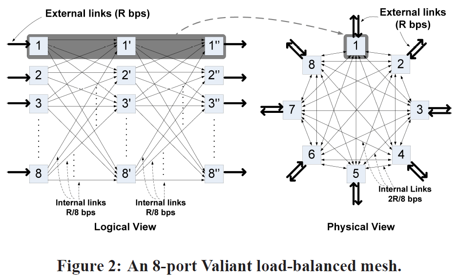

# RouteBricks: Exploiting Parallelism To Scale Software Routers

## First things first

#### What is the paper about?
- **Scaling software routers**
- The primary objective of this paper is to explore the problem of scalability in software routers in the given context of high-speed parallel processing available in servers.
- The paper takes the approach of parallelizing workloads across servers and across cores within a server
- Router workloads are suited for this approach
###### What are software routers?
Simply put, routing functionalities implemented using software on general-purpose hardware instead of using specialized hardware.
For a more in-depth discussion on software routers see [Implementation and Performance Comparison of High-Capacity Software Routers](https://www.sciencedirect.com/science/article/pii/S1389128620312238)

#### What is the output?
- A router architecture that supports 35Gbps throughput
- This architecture can easily be scaled by adding servers
- Fully programmable - built entirely from off-the-shelf, general-purpose hardware

## Introduction
- The focus of the industry has been to develop hardware with very specific functionalities and with the primary attention to the performance
- Meanwhile, networks have taken up much more sophisticated roles (e.g., IDS, firewalls, data-loss protection)
- But in the absence of software extensibility, the approach taken has been that of middleboxes - high-performance specialized hardware, but the cost of implementation, maintenance and management is high
- Interest has been growing for extensible packet-processing router.
- Problem:
	- The implementation of desired functionality necessarily means modification to the router's high-speed data plane per-packet processing
	- A special purpose hardware is designed to be "closed" to extension by nature (Why is that? Because functionality is usually built into the h/w, and software extensibility in such cases)
	- It is pretty much an "either-or" relation between high performance and extensibility
- Two approaches to solve this problem:
	- Use specialized devices and make them more programmable - only possible to a small extent and requires specialized, low-level knowledge of the hardware
	- Implement software routers and optimize for high performance
		- Easier to innovate - larger community of programmers
		- Possible to extend the data plane and the control plane functionality
		- Functionality can be modified through software-only upgrades
		- Router developers will be relieved of hardware design burden
- Using commodity hardware has other advantages too
	- Economic benefits of large-volume manufacturing, supply and support
	- Benefits from advancements in semi-conductor tech, advanced power management features
- Challenge: Scaling this approach to high-speed networks

This paper explores the second approach - scaling software router performance to match specialized devices

> Performance comparison as of the time of this study -
> **Carrier grade routers** - 10Gbps to 92Tbps
> **Software routers** - 1-5Gbps

Solution devised in this paper -
> **RouteBricks**
> A router architecture that uses both of the following strategies:
> 1 - Parallelize router functionality across servers
> 2 - Parallelize router functionality across cores within one server

Three packet-processing applications are studied -
1. Packet forwarding
2. Traditional IP routing
3. IPsec encryption

## Design Principles
> **Background**
> A router has two functionalities -
> 1. Packet processing - done by linecards connected to input ports
> 2. Packet forwarding - done by the switching fabric
> Each linecard processes packets at line rate R and the switching fabric should do it at the rate NR

Existing software routers follow "single server as router" approach.
NR can be fairly high for even mid-range routers which is impossible to match up to for a single server
#### Design Principle 1
_The router functionality should be parallelized across multiple servers_
- This way the workload can be distributed and workload requirements per server are met.
- Each server acts as a router linecard
- This architecture is incrementally extensible in terms of the number of ports

#### Design Principle 2
_Router functionality should be parallelized across multiple processing paths within each server_
- This is because, to take on the responsibility of its individual workload of a baseline rate of 10Gbps, a server would have to scale to at least 20Gbps ([shown later](RouteBricks#^f56685))

## The Design

**Traditional router architecture**

**Cluster Router Architecture**

- A router with $N$ ports
- Each server acts as a port - full-duplex line rate $R$ bps
- Packet processing rate per server proportional to $R$
- Functionality is parallelized across multiple routers
- Decentralized solution - load-balanced interconnects so that each node can independently make forwarding decisions
- No server needs to operate at a rate higher than $cR$ where $c$ is independent of $N$ and ranges from 2 to 3
So using the above rules, we design a cluster with $N$ ports and line rate $R$ bps, using servers whose performance need only scale with $cR$, independent of $N$. ^f56685

**Design Tradeoff** - RouteBricks cannot offer strict performance guarantees like traditional routers

## Parallelizing Across Servers
Focus - Designing a distributed switching solution that is compatible with the use of commodity servers

Two problems required to be solved here:
1. Providing a physical path connecting input and output ports
2. Determining which input gets to relay a packet to which output port

Three guarantees:
1. 100% throughput (output ports can operate at $R$ bps if required)
2. Fairness (each input port gets a fair share of the capacity of any output port)
3. Avoid reordering packets (which is an undesirable scenario under TCP)

The choice of using commodity hardware presents the following three constraints:
1. _Limited internal link rates_: Internal links cannot run higher than external line rate $R$
	- This constraint is more of a design constraint to limit the cost. E.g., 100Gbps internal links could be used for 10Gbps external links, but the cost might not be feasible
2. _Limited per-node processing rate_: A single server can run at a rate no higher than $cR$
	- This is due to the performance limitations of servers at the time
3. _Limited per-node fanout_: Each server can only have a physical connection to a few other servers
	- This limitation exists because the servers can have only a small number of NICs with each NIC limited to 2-8 ports

>The topology design has to solve the two problems while providing the three guarantees and keeping the three constraints in mind.
>The attention would be on minimizing the cost, which, in this case is the interconnect capacity (number of servers $×$ link rate).
>The number of servers will have to be minimized as that is the dominant cost.

#### Routing Algorithms (Forwarding)
###### Topology Design options
1. _Single-path_: The traffic from input to output port follows a single path
	1. _Static single-path_: The path remains constant
	2. _Adaptive single-path_: Centralized scheduler recomputes path based on the current demand
2. _Load-balanced_: Traffic is spread between multiple paths

Static single-path cannot be used because the internal link will handle aggregated traffic, which means that it will need to operate at a rate higher than the external links (violation of constraint 1).
Adaptive single-path cannot be used because it requires a centralized component to analyze the router state and should operate at $NR$ (violation of constraint 2).

We use a load-balancing algorithm - Valiant Load Balancing (VLB) and adapt it to our needs

###### Valiant Load Balancing
$N$ nodes are arranged in full mesh as shown below:

Forwarding from source node $S$ to destination node $D$ is performed in two phases:
- _Phase 1_: Node $S$ chooses at random an intermediate node to which to forward this packet
- _Phase 2_: The intermediate node forwards this packet to output node $D$

As a result of phase 1:
- The traffic received at each node is uniform. This enables a node to autonomously make a forwarding decision (without having a concern about the congestion at the output link). This enables VLB to achieve **100% throughput and fairness** (first and second guarantees).
- Since the traffic is uniform **a speedup is not required** (our first constraint is met). Each internal link must have the capacity $\frac{2R}{N}$ where "2" accounts for the double traversal, and dividing by $N$ reflects the distribution of traffic across all nodes
Since each node is full-duplex, it has to handle $2R$ traffic rate + $R$ because of additional traversal. This means instead of $2R$, each server has to process traffic at rate $3R$, which is a 50% processing overhead.
###### Direct VLB
- This is an optimization over VLB to reduce the overhead caused by the additional traversal.
- It is often the case that the router traffic is already uniform. Redirection of packets to intermediate nodes in this case doesn't add any benefits but does add to the overhead.
- Direct VLB approach says that each source node $S$ forwards up to $\frac{R}{N}$ of the incoming traffic directly to $D$. Rest of the traffic is redirected over intermediate nodes.
- This way, when the incoming traffic is close to uniform, each server processes a maximum rate of $2R$ (no VLB overhead)

> Our second constraint was that each server should process traffic at rate $cR$. For Direct VLB, c can range from 2 (incoming traffic is uniform) to 3 (non-uniform incoming traffic).

###### Issues that still remain
1. Reordering is possible
2. Server fanout  constraint cannot be met for $N$ > server fanout

###### Solution
1. Assign to each server as many ports as it can handle. If the fanout allows, then connect them directly into a mesh topology.
2. If the number of servers cannot be accommodated by the fanout, then use a k-ary n-fly topology, where k is the per-server fanout and $n = log_k N$.

Example of a 2-ary 3-fly network topology:

## Questions:
1. With the innovations and programmability of SDNs, what is the relevance of RouteBricks?
2. If they take the same approach as NFVs, what is the difference?
3. What are the applications of programmability in the data plane? (again in the context that SDNs are available as an alternative)
4. Why is the need for scaling the servers with cR instead of just R?
5. Have there been studies on if we took the alternative approach of going with a specialized or programmable computer instead and then build on the programmability?
6. An approach taken by this architecture is to exploit multi-core parallelism in hardware that provides this service (which is almost all processors these days). Have there been studies done on leveraging GPUs for this, given the much higher core count?
7. What would be the implications of using ARM-based SoCs for this architecture, given there speed, power efficiency and cost-effectiveness?
